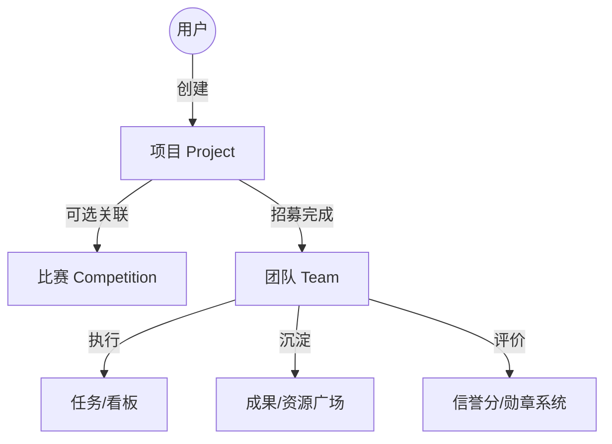

# 校园组队生态系统 - Team Up Project

基于 **多维技能标签** 与 **双向加权匹配算法** 的一站式校园组队协作平台。

---

## 🌟 项目核心理念

本项目不仅是一个组队工具，更是一个**以项目为核心单元**的校园协作生态。我们打破了传统的“先组队后找事”模式，采用“**项目驱动 (Project-Driven)**”逻辑：

- **项目是第一公民**：用户围绕具体目标（比赛、科研、实践）创建项目。
- **团队是执行实体**：项目招募完成后自动转化为执行团队，支持临时解散或长期复用。
- **比赛是可选导向**：项目可关联各类赛事，形成“发现赛事 -> 组建项目 -> 沉淀成果”的闭环。

---

## 🏗️ 核心业务模型

基于《核心业务逻辑深度分析方案》，项目采用**混合模型**架构：



### 核心匹配机制 (Weighting logic)
- **成员找项目**：技能匹配(40%) + 时间(25%) + 兴趣(20%) + 比赛偏好(10%)。
- **项目找成员**：必需技能(50%) + 历史信誉(20%) + 时间投入(20%)。
- **新手保护**：为新用户提供 30 天“新手光环”，在匹配权重中给予固定加成，解决冷启动问题。

---

## 🎨 生态综合广场 (Union Plaza)

项目提供统一的生态入口，包含五大核心模块：

1. **项目大厅 (Project Hall)**：核心招募地，支持“新手友好”筛选与匹配度感知。
2. **人才墙 (Talent Square)**：展示活跃用户的技能名片，支持项目发起人“反向挖掘”。
3. **赛事中心 (Competition Center)**：聚合校内外赛事，直接查看该赛事关联的活跃项目。
4. **成果广场 (Asset Square)**：沉淀项目归档产出的开源代码、面经、技术方案。
5. **任务/悬赏墙 (Bounty Board)**：针对短期、轻量化的技术需求（如改 Bug、画 Logo）提供快速协作入口。

---

## 🛠️ 技术架构

### 后端服务 (Spring Boot)
- **核心框架**：Spring Boot 2.7 + MyBatis-Plus
- **数据库**：MySQL 8.0 (主存储) + Redis (缓存/通知)
- **实时通信**：Socket.IO (团队群聊/系统通知)
- **安全校验**：JWT + Spring Security

### 匹配服务 (FastAPI)
- **技术栈**：Python 3.11 + FastAPI
- **职责**：基于用户画像和项目需求执行高并发的加权匹配算法。

### 前端应用 (Vue 3)
- **核心框架**：Vue 3 (Composition API) + TypeScript
- **UI 组件库**：Element Plus
- **状态管理**：Pinia
- **构建工具**：Vite

---

## 🚀 快速启动

### 1. 数据库配置
执行 `backend/db_schema.sql` 初始化数据库表结构。

### 2. 后端服务 (TeamUp Server)
```bash
cd backend/teamup-server
mvn clean install
mvn spring-boot:run
```

### 3. 匹配服务 (Matching Service)
```bash
cd matching-service
pip install -r requirements.txt
python main.py
```

### 4. 前端应用 (Frontend)
```bash
cd frontend
npm install
npm run dev
```

---

## 📁 目录结构概览

```
team-up-project/
├── backend/                    # Spring Boot 后端源码
├── frontend/                   # Vue 3 前端源码
├── matching-service/           # Python 匹配算法服务
├── project-files/docs/         # 核心业务分析与设计文档
└── tests/                      # 自动化测试脚本 (Admin Smoke/E2E)
```

---

## 🤝 贡献与规范

- **提交规范**：遵循 `feat:`, `fix:`, `docs:`, `chore:` 前缀规范。
- **开发流程**：建议在 `develop` 分支开发，通过 `PR` 合并至 `main`。

**版本**: v1.1  
**最后更新**: 2026-02-10
