# 🔄 Team Up 业务流程图

## 1. 用户注册流程

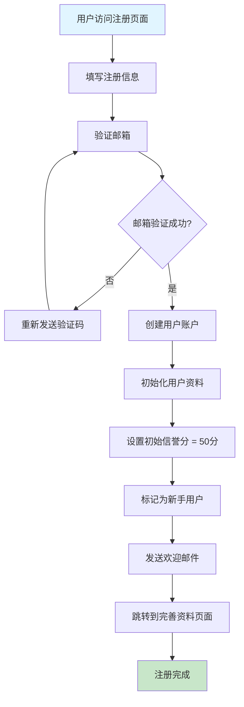

## 2. 项目创建流程

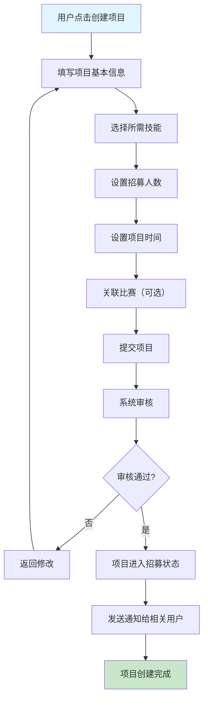

## 3. 项目申请流程

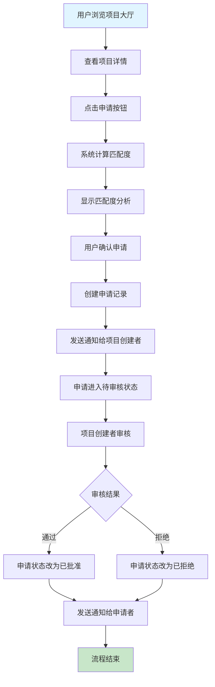

## 4. 项目招募完成流程

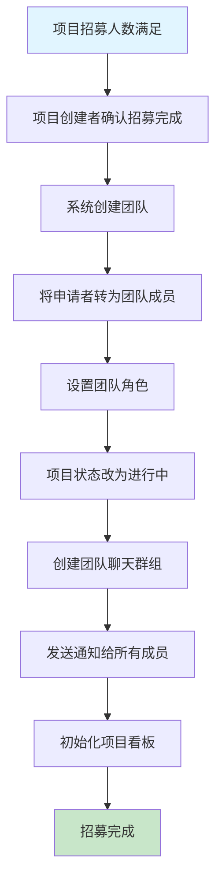

## 5. 项目完成评价流程

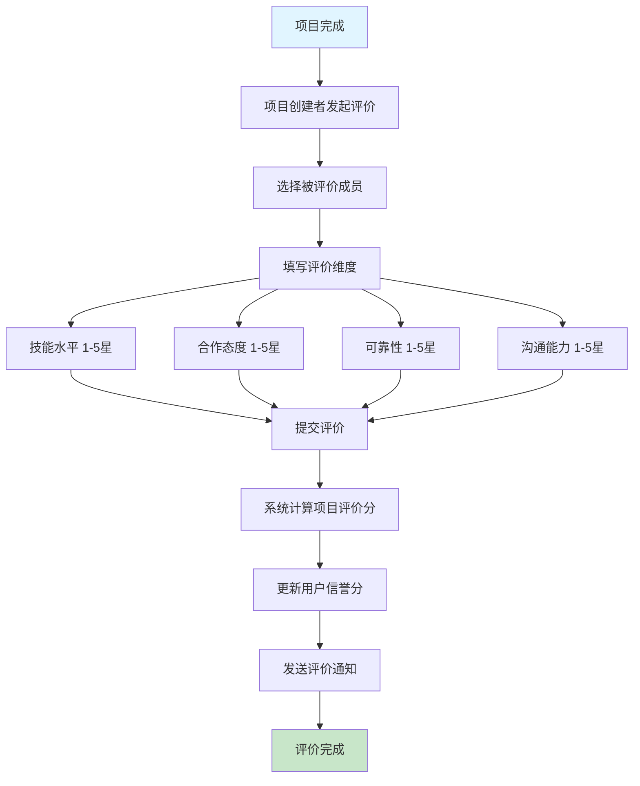

## 6. 信誉分更新流程

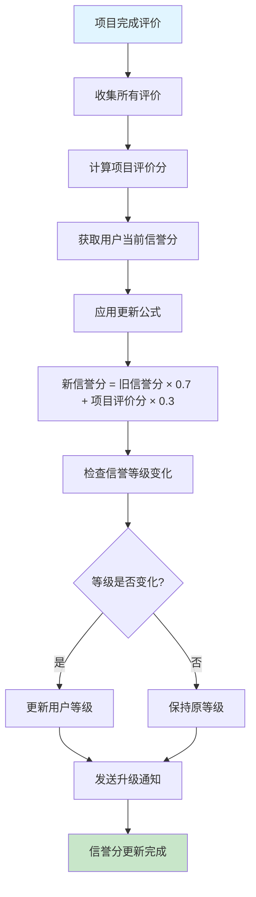

## 7. 新手保护流程

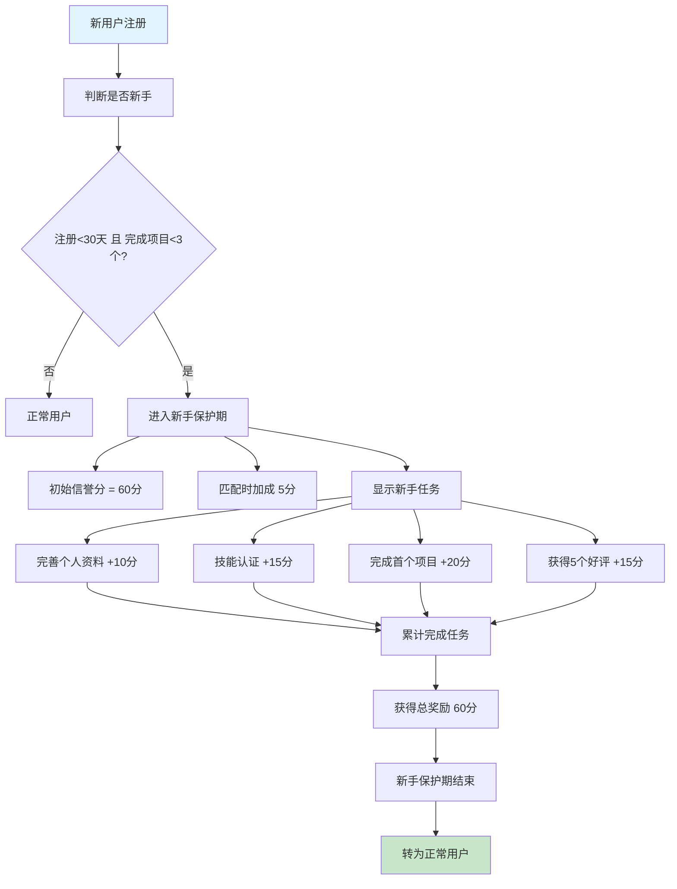

## 8. 团队邀请流程

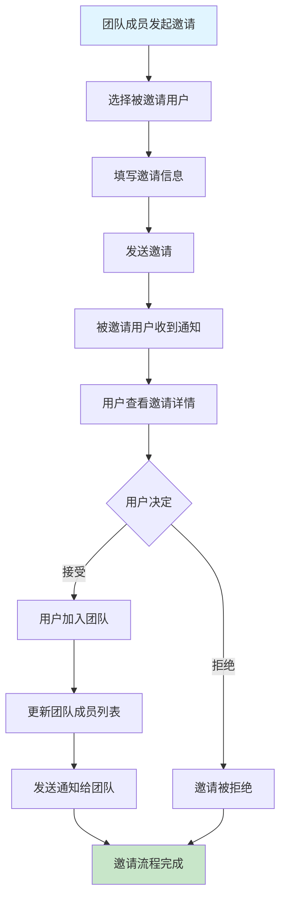

## 9. 消息通知流程

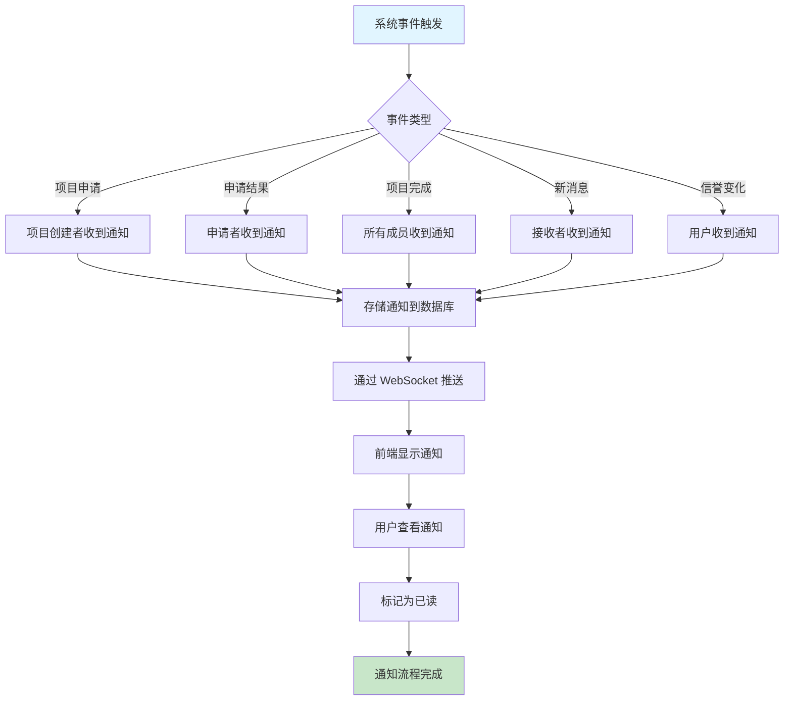

## 10. 匹配算法执行流程

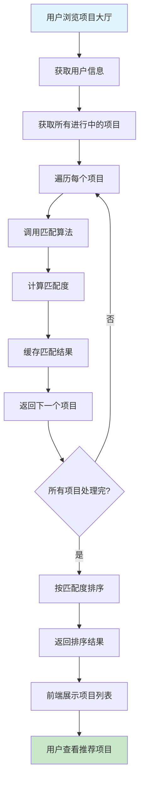

## 11. 用户搜索和筛选流程

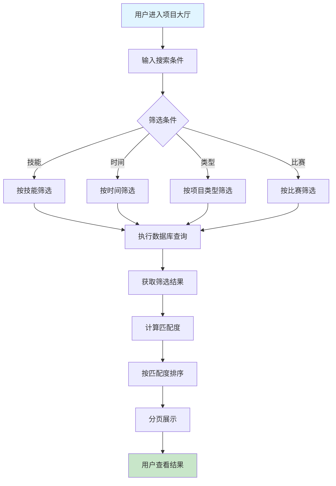

## 12. 项目成果沉淀流程

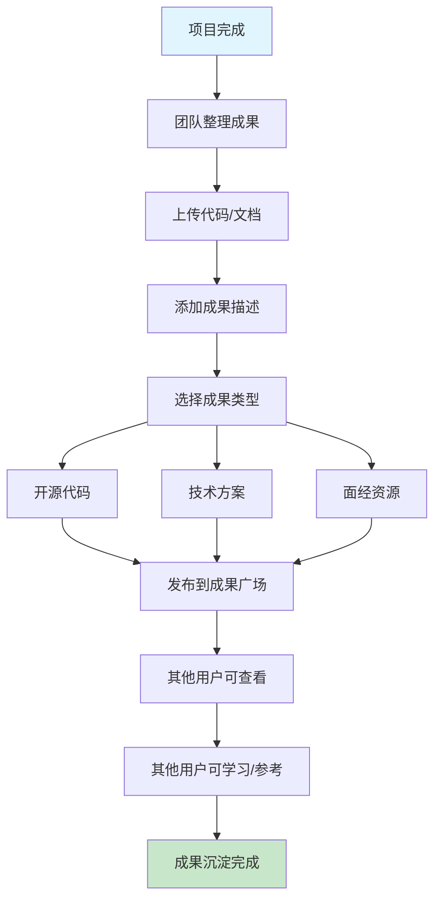

---

**文档版本**：v1.0  
**最后更新**：2026-03-04
