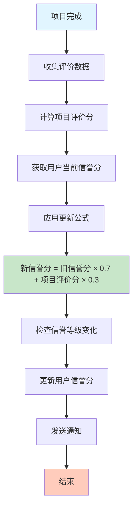
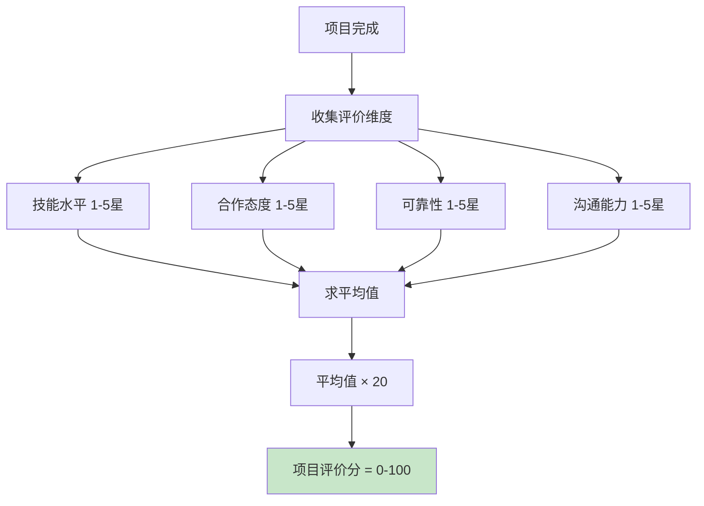
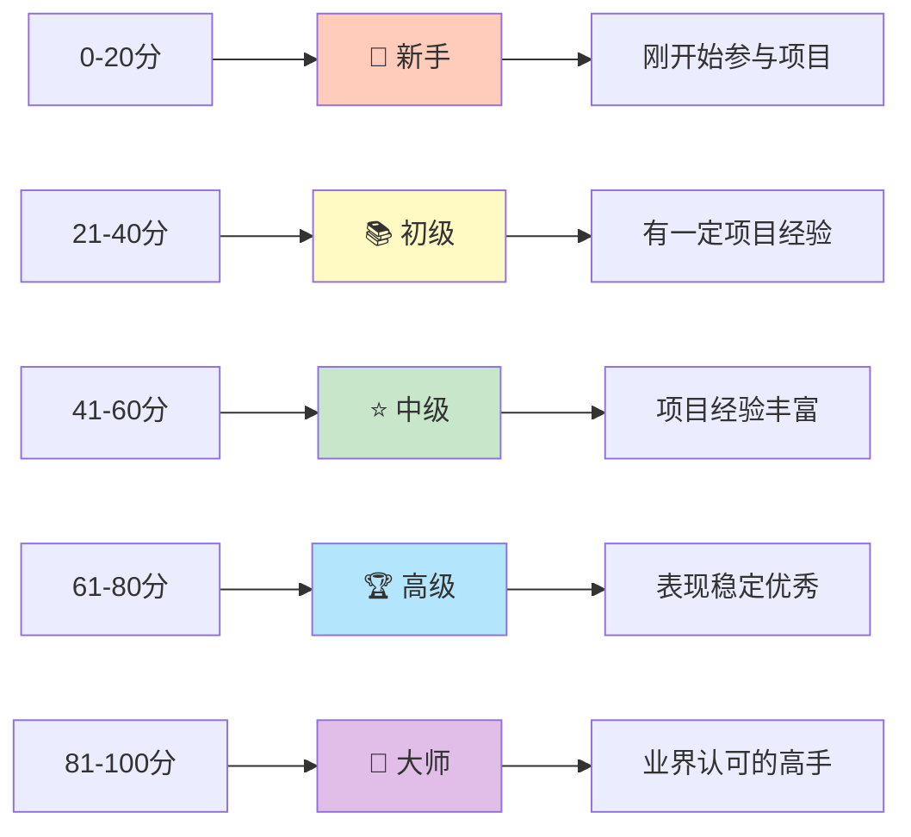
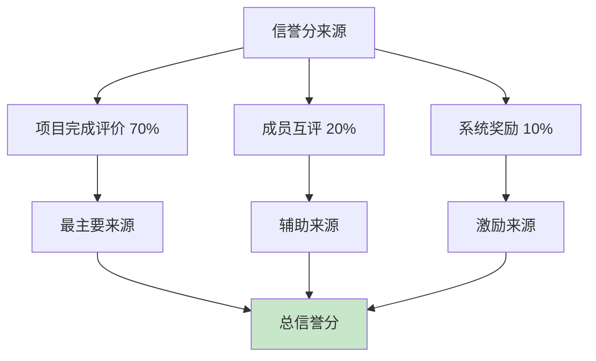
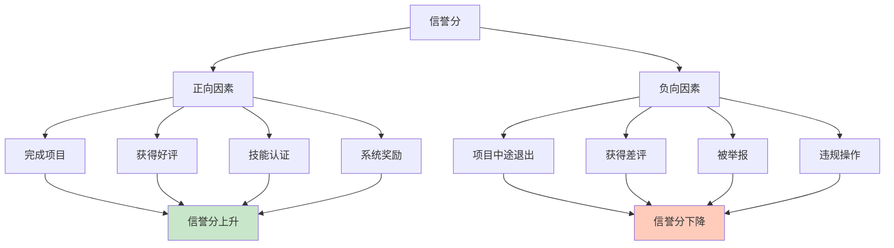
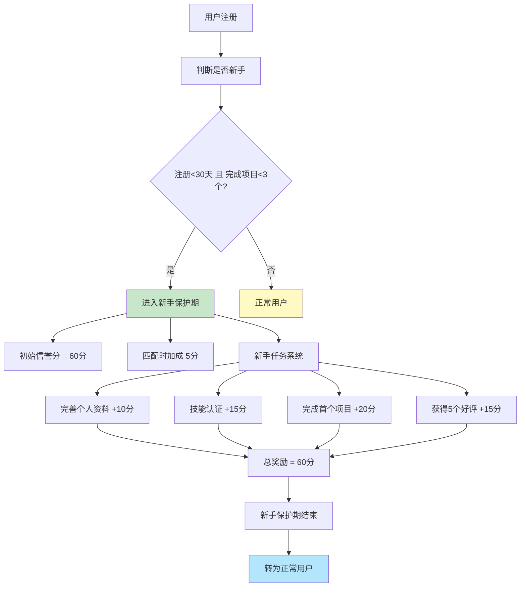
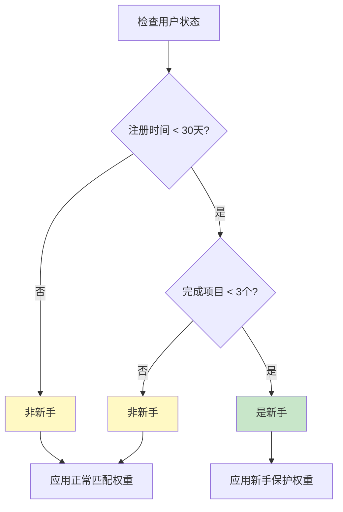
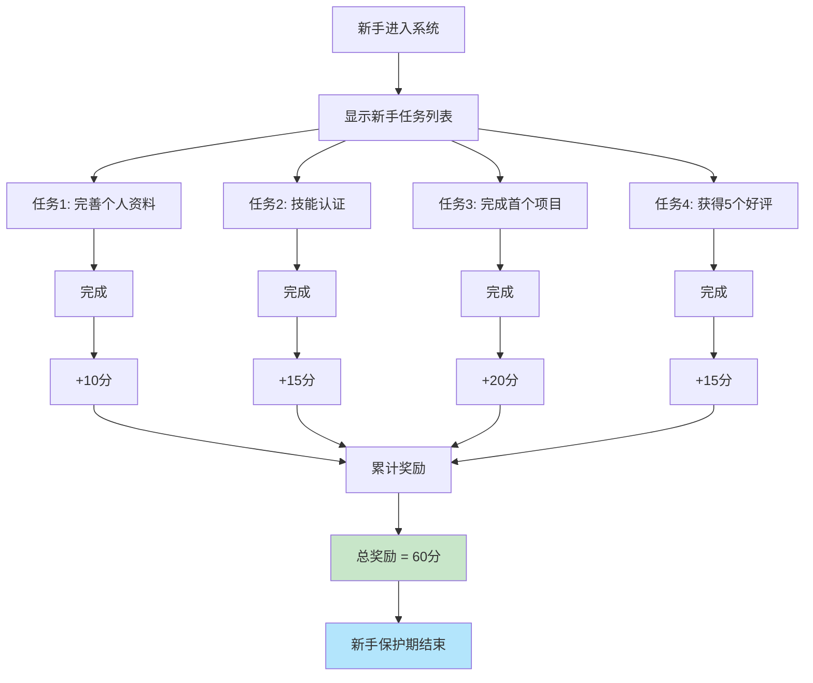
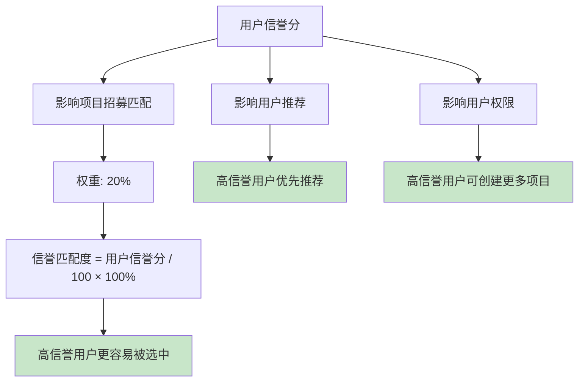
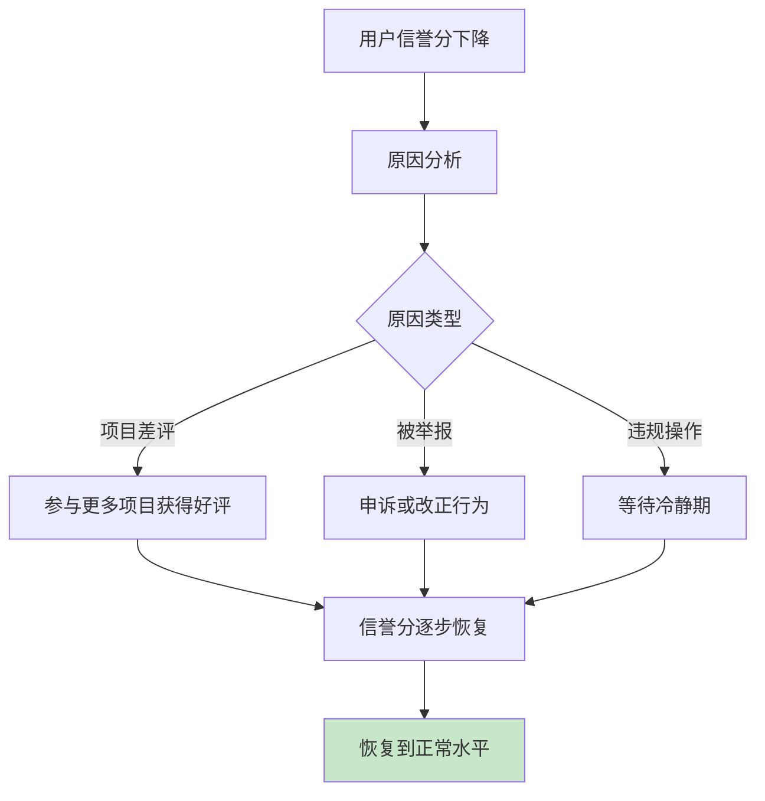

# 💳 Team Up 信誉系统流程图

## 1. 信誉分更新流程

## 2. 项目评价分计算

## 3. 信誉等级系统

## 4. 信誉分来源

## 5. 信誉分影响因素

## 6. 新手保护机制

## 7. 新手判定逻辑

## 8. 新手任务完成流程

## 9. 信誉分与匹配度关系

## 10. 信誉分恢复机制

---

**文档版本**：v1.0  
**最后更新**：2026-03-04
