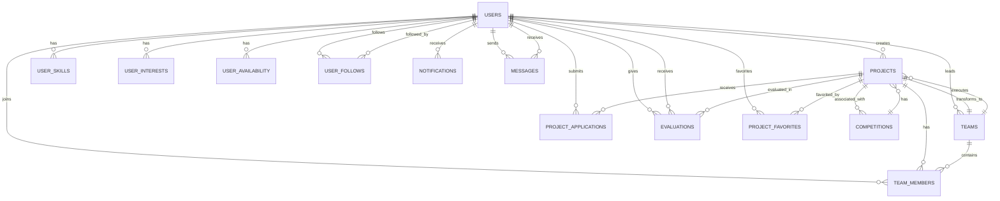
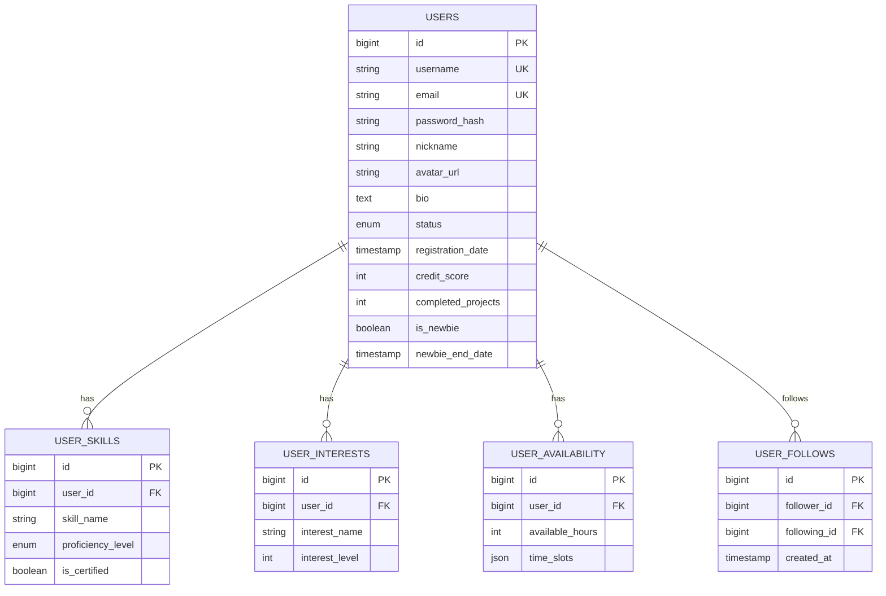
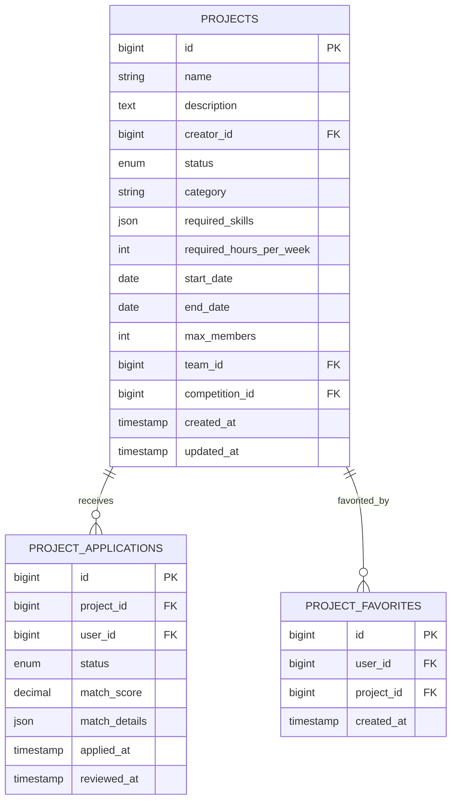
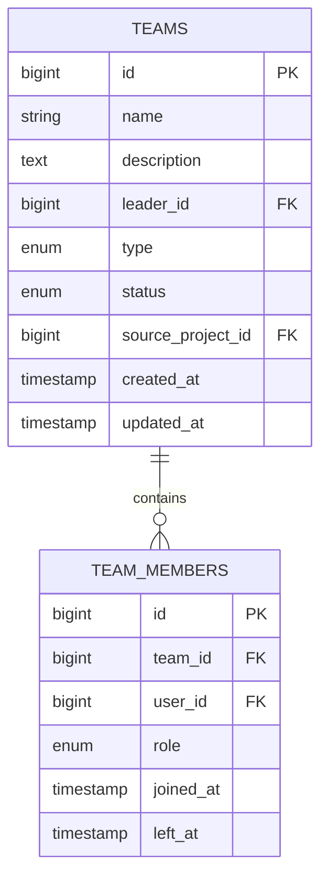
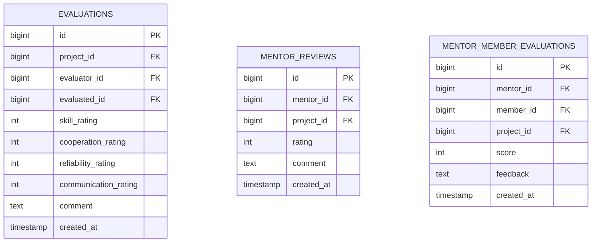
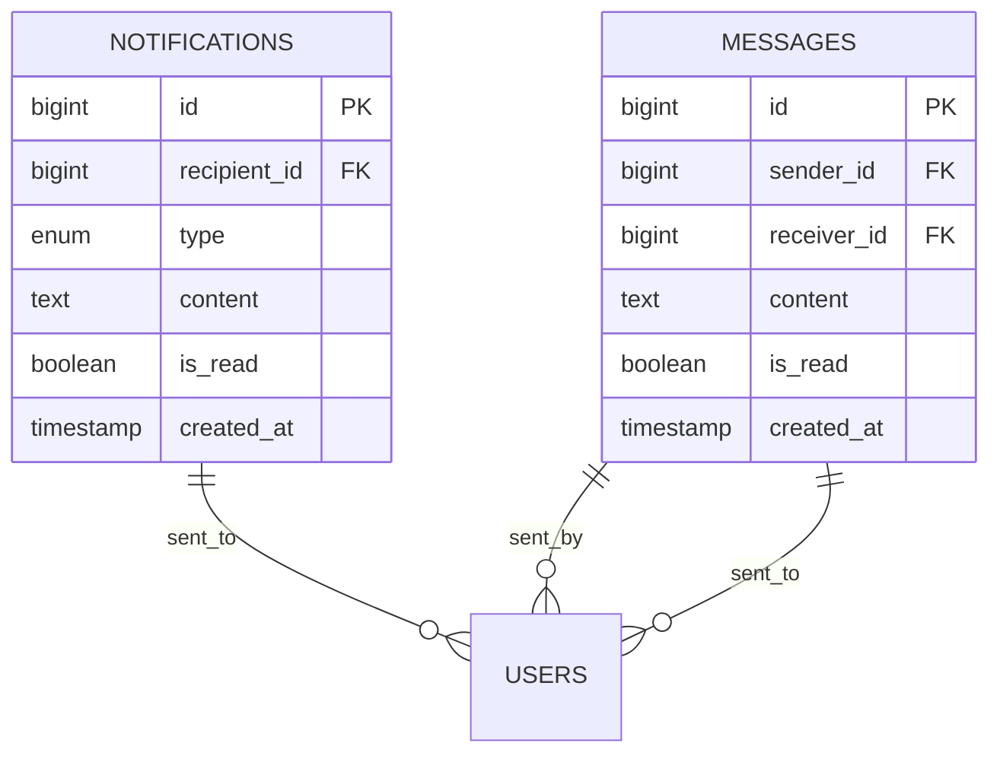
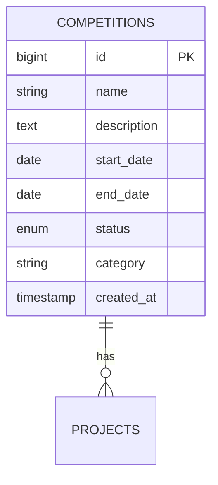
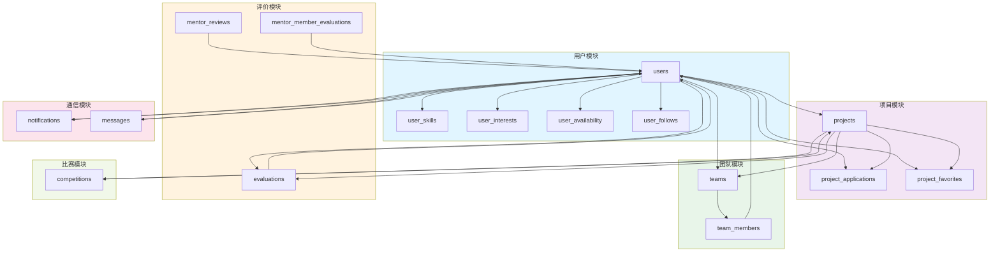
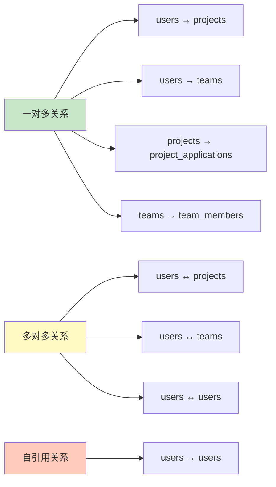
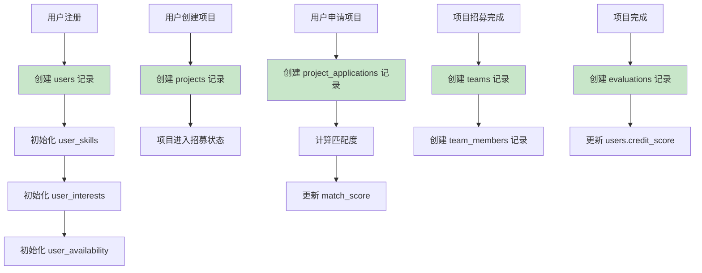

# 📊 Team Up 数据库 ER 图 - Mermaid 版本

## 1. 核心实体关系图

## 2. 用户相关表

## 3. 项目相关表

## 4. 团队相关表

## 5. 评价相关表

## 6. 通知和消息表

## 7. 比赛相关表

## 8. 完整数据库关系图

## 9. 表间关系统计

## 10. 数据流向图

---

**文档版本**：v1.0  
**最后更新**：2026-03-04
