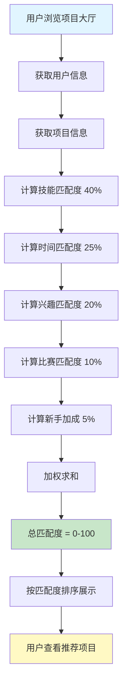
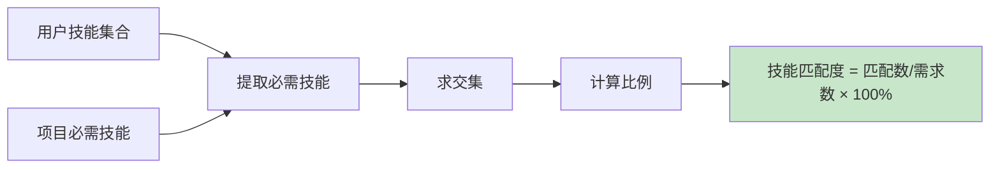
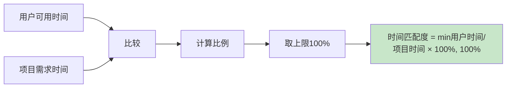
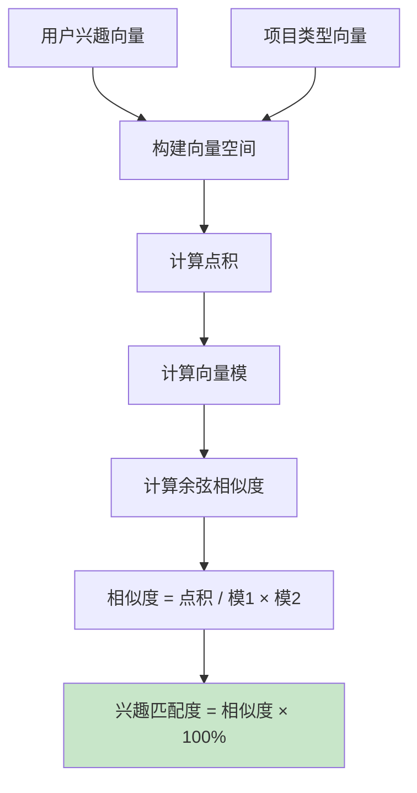
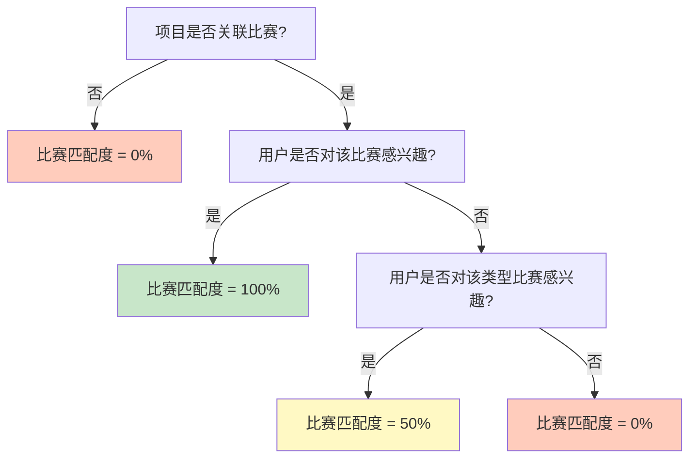
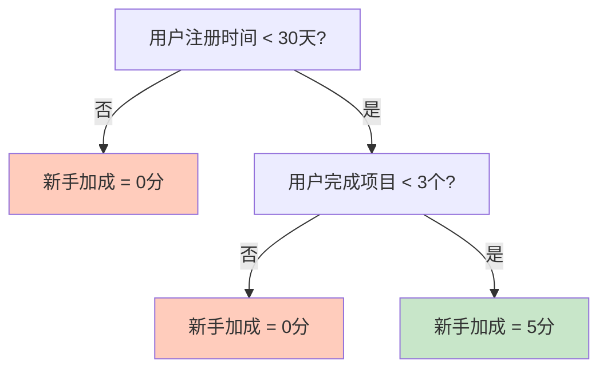
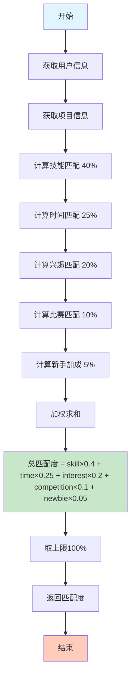
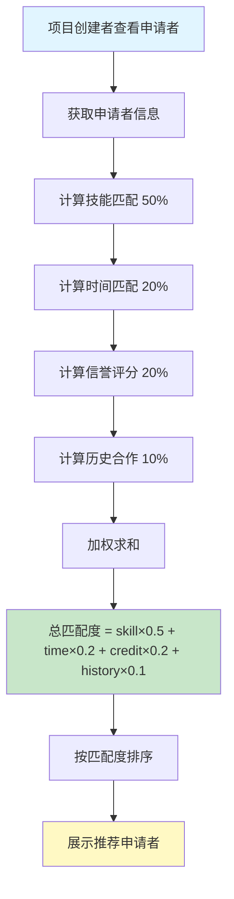
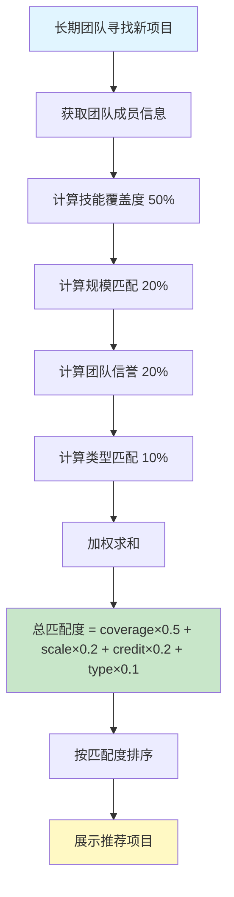
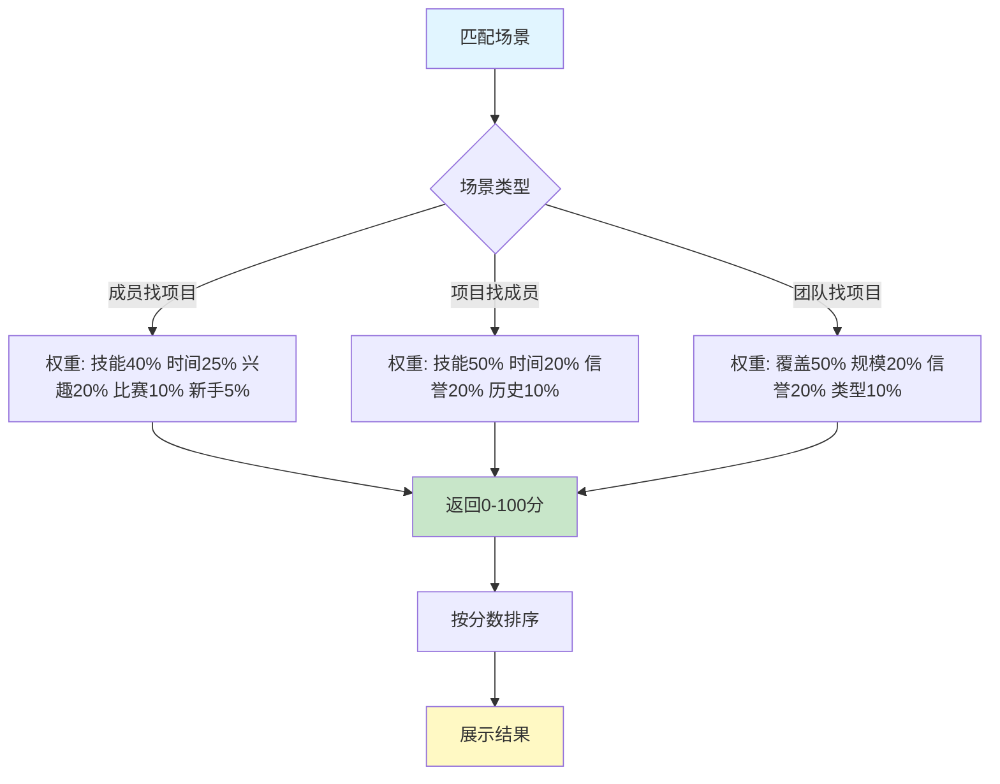

# 🎯 Team Up 匹配算法流程图

## 1. 成员找项目匹配流程

## 2. 技能匹配度计算

## 3. 时间匹配度计算

## 4. 兴趣匹配度计算 - 余弦相似度

## 5. 比赛匹配度计算

## 6. 新手加成计算

## 7. 完整匹配算法流程

## 8. 项目招募成员匹配流程

## 9. 团队找项目匹配流程

## 10. 匹配算法决策树

---

**文档版本**：v1.0  
**最后更新**：2026-03-04
