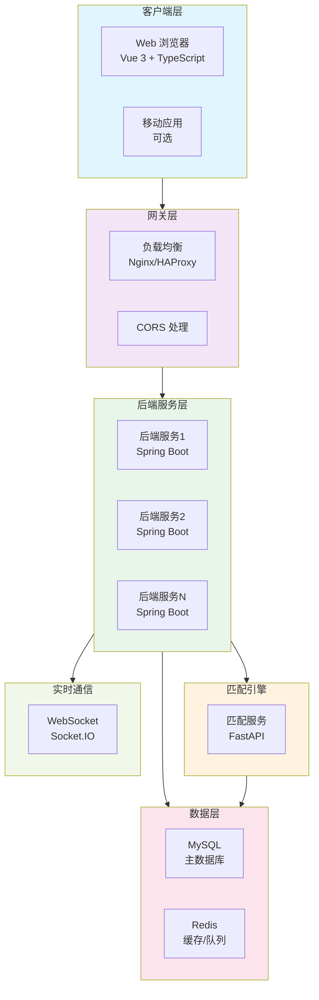
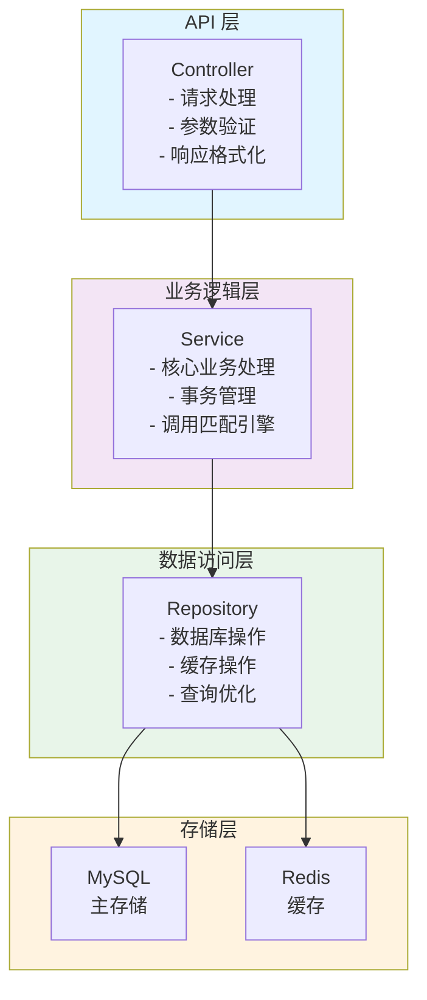
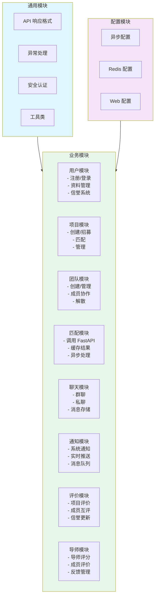
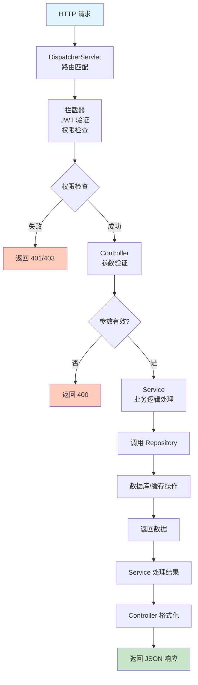
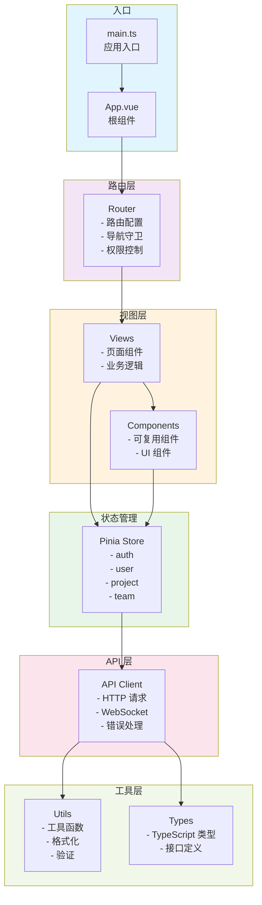
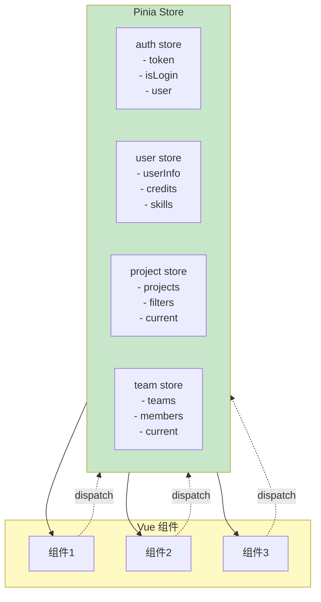
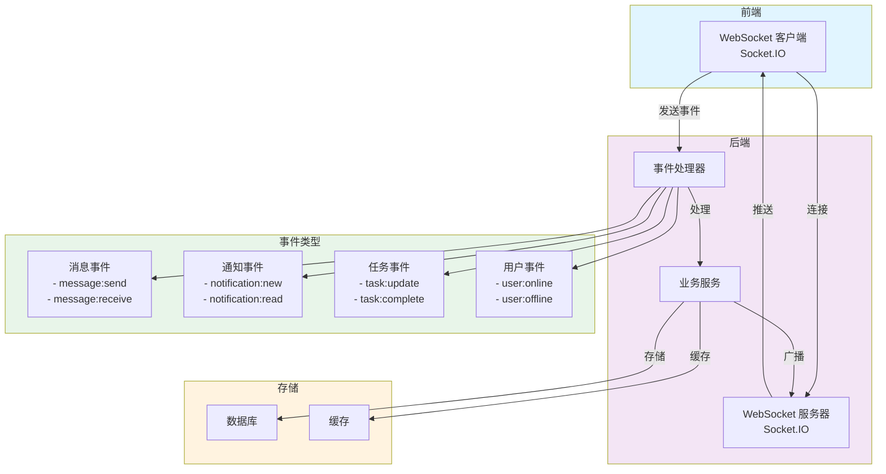
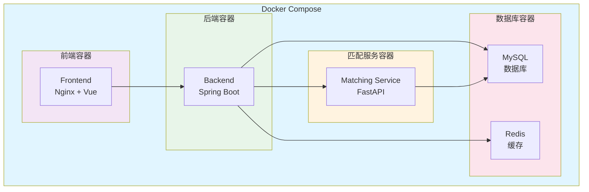
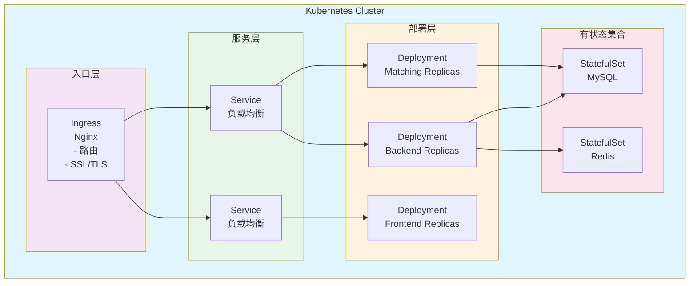
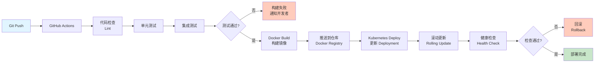

# 🏗️ Team Up 系统架构图 - Mermaid 版本

## 1. 整体系统架构

## 2. 后端分层架构

## 3. 后端模块划分

## 4. 请求处理流程

## 5. 前端架构

## 6. 状态管理架构

## 7. WebSocket 实时通信架构

## 8. 部署架构 - Docker Compose

## 9. Kubernetes 部署架构

## 10. CI/CD 流程

---

**文档版本**：v1.0  
**最后更新**：2026-03-04
